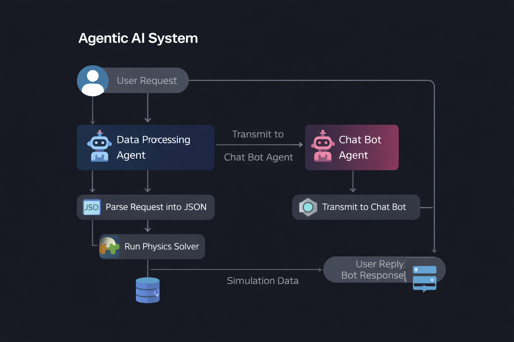

# AI Physics Lab

Build a web-based interface that allows users to run physics simulations (including but not limited to heat transfer and solid mechanics) directly from natural language prompts. For example, a user might type: **“Simulate the heat transfer through a thin 30 nm conductor.”**

## Approach

Adopt an **agentic architecture** (e.g., master-agent loops and MCPs) to orchestrate the simulator.

### Your system should

1. **Provide “zero-barrier” simulations**  
   The app should be hosted with everything preinstalled, so all a user needs to do is type in a prompt.

2. **Interpret the prompt**  
   Parse the natural language input and configure the appropriate PDE system.

3. **Set up and solve the model**  
   Use finite element simulations powered by **FEniCS / DOLFINx** on a backend server.

4. **Deliver results interactively**  
   Render the simulation results in the frontend as an interactive **3D visualization**, allowing users to zoom, rotate, and explore computed fields.

5. **Adaptability**  
   Easily extend to new PDEs, boundary conditions, materials, and geometries by adding:
   - parsing rules / entities
   - new solver modules
   - new frontend field renderers

---

## 🧠 Agentic AI System Architecture

  

